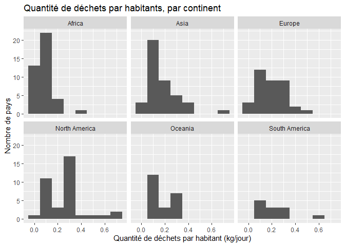
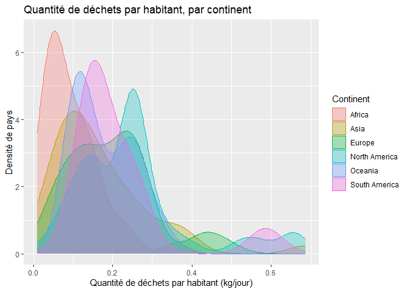
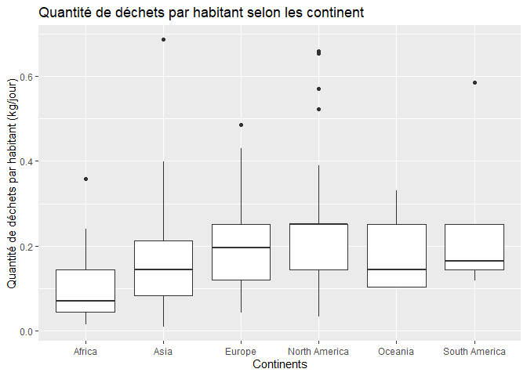
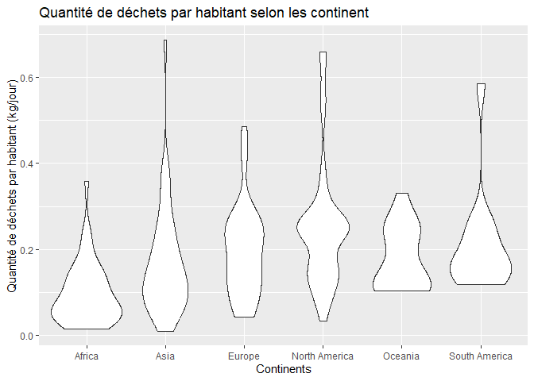
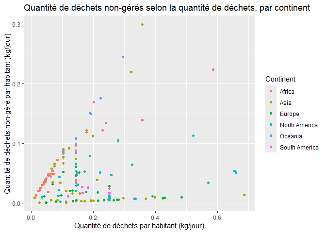
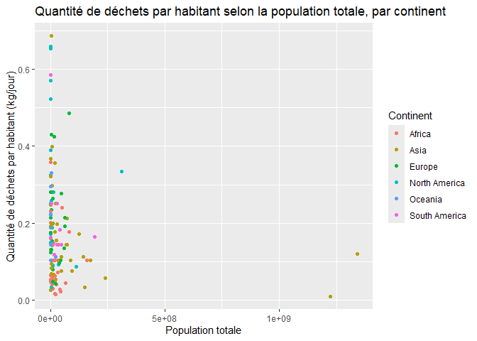
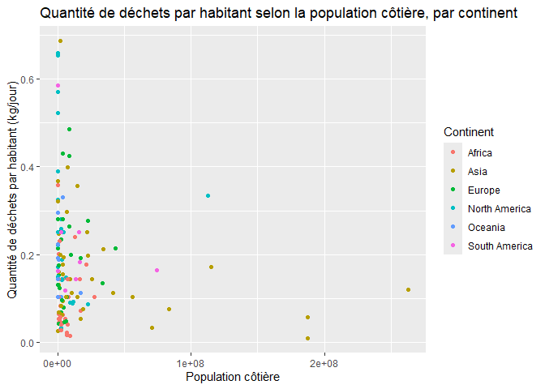
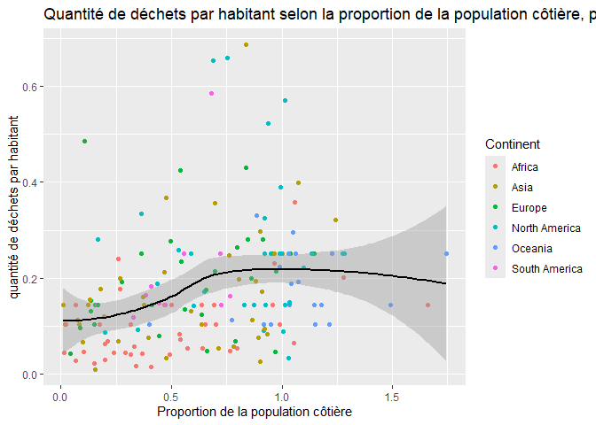

Lab 02 - Plastic waste
================
Charlotte Bouchard
15-09-2025

## Chargement des packages et des données

``` r
library(tidyverse) 
```

``` r
plastic_waste <- read_csv("data/plastic-waste.csv")
```

Commençons par filtrer les données pour retirer le point représenté par
Trinité et Tobago (TTO) qui est un outlier.

``` r
plastic_waste <- plastic_waste %>%
  filter(plastic_waste_per_cap < 3.5)
```

## Exercices

### Exercise 1

``` r
ggplot(plastic_waste, aes(x=plastic_waste_per_cap,)) +
  geom_histogram(binwidth=0.1) +
  facet_wrap(~continent) + 
  labs(title="Quantité de déchets par habitants, par continent", x="Quantité de déchets par habitant (kg/jour)", y="Nombre de pays")
```

<!-- -->

### Exercise 2

``` r
ggplot(plastic_waste, aes(x = plastic_waste_per_cap, colour=continent, fill = continent)) + 
  geom_density(alpha = 0.3) + 
  labs(title="Quantité de déchets par habitant, par continent", x="Quantité de déchets par habitant (kg/jour)", y="Densité de pays", colour="Continent", fill="Continent")
```

<!-- -->

Le réglage de la couleur est dans « aes » et le réglage de la
transparence est dans « geom_density » car le premier est selon chaque
variable (le mapping), alors que la transparence fixe la propriété pour
tout le graphique (le setting).

### Exercise 3

Boxplot:

``` r
ggplot(plastic_waste, aes(x=continent, y=plastic_waste_per_cap)) + 
  geom_boxplot() + 
  labs(title="Quantité de déchets par habitant selon les continent", x="Continents", y="Quantité de déchets par habitant (kg/jour)")
```

<!-- -->

Violin plot:

``` r
ggplot(plastic_waste, aes(x=continent, y=plastic_waste_per_cap)) + 
  geom_violin() + 
  labs(title="Quantité de déchets par habitant selon les continent", x="Continents", y="Quantité de déchets par habitant (kg/jour)")
```

<!-- -->

Les violin plots permettent de voir plus précisément la distribution des
données, alors que les box plots ne font que montrer les tendances.

### Exercise 4

``` r
ggplot(plastic_waste,aes(x=plastic_waste_per_cap, y=mismanaged_plastic_waste_per_cap, colour = continent)) + 
  geom_point() + 
  labs(title="Quantité de déchets non-gérés selon la quantité de déchets, par continent", x="Quantité de déchets par habitant (kg/jour)", y="Quantité de déchets non-géré par habitant (kg/jour)", colour="Continent")
```

<!-- -->

On remarque que l’Europe gère beaucoup mieux ses déchets que les autres
continents. Au contraire, l’Asie et l’Océanie sont généralement les
pires.

### Exercise 5

``` r
ggplot(plastic_waste, aes(y=plastic_waste_per_cap, x=total_pop, colour=continent)) + 
  geom_point() + 
  labs(title="Quantité de déchets par habitant selon la population totale, par continent", x="Population totale", y="Quantité de déchets par habitant (kg/jour)", colour="Continent")
```

    ## Warning: Removed 10 rows containing missing values or values outside the scale range
    ## (`geom_point()`).

<!-- -->

``` r
ggplot(plastic_waste, aes(x=coastal_pop, y=plastic_waste_per_cap, colour=continent)) + 
  geom_point() + 
  labs(title="Quantité de déchets par habitant selon la population côtière, par continent", x="Population côtière", y="Quantité de déchets par habitant (kg/jour)", colour="Continent")
```

<!-- -->

Il ne me semble pas avoir de relation plus forte pour l’une des paires
de variables.La seule conclusion que je peut en tirer est par rapport à
la quantité de population côtière par continent.

## Conclusion

Recréez la visualisation:

``` r
plastic_waste_coastal <- plastic_waste %>% 
  mutate(coastal_pop_prop = coastal_pop / total_pop) %>%
  filter(plastic_waste_per_cap < 3)

ggplot(plastic_waste_coastal, aes(x=coastal_pop_prop, y=plastic_waste_per_cap, colour=continent)) + 
  geom_point() + 
  geom_smooth(method="loess", se=TRUE, colour="black") + 
  labs(title="Quantité de déchets par habitant selon la proportion de la population côtière, par continent", x="Proportion de la population côtière", y="quantité de déchets par habitant", colour="Continent")
```

    ## `geom_smooth()` using formula = 'y ~ x'

    ## Warning: Removed 10 rows containing non-finite outside the scale range
    ## (`stat_smooth()`).

    ## Warning: Removed 10 rows containing missing values or values outside the scale range
    ## (`geom_point()`).

<!-- -->
